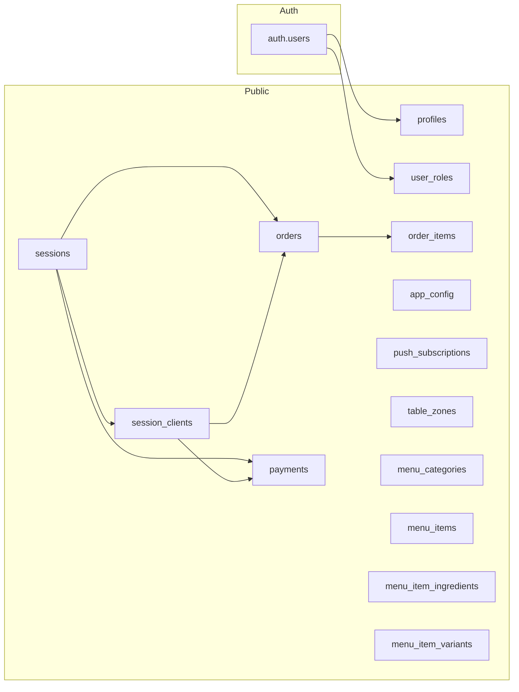

# Dados coletados em toda a aplicação

Este documento mapeia **todos os dados** que a aplicação coleta e persiste no banco (Supabase), por tabela e por fluxo de uso.

---

## Visão por tabela

---

### 1. `profiles`

| Campo      | Tipo   | Onde é coletado |
|-----------|--------|------------------|
| `user_id` | UUID   | Preenchido pelo trigger ao criar usuário em `auth.users`. |
| `full_name` | TEXT | Login (cadastro), Admin (criação/edição de usuário). |
| `cpf`     | TEXT   | Admin (criação de usuário por CPF). Opcional se houver criação por email. |
| `created_at`, `updated_at` | TIMESTAMPTZ | Automático. |

**Fluxos:** Cadastro (email + nome), painel Admin (usuários: criar com CPF/nome, editar nome).

---

### 2. `user_roles`

| Campo   | Tipo      | Onde é coletado |
|--------|-----------|------------------|
| `user_id` | UUID   | Trigger `handle_new_user` (default: attendant); Admin ao criar/editar usuário. |
| `role`  | app_role  | Admin (ao criar usuário: admin, attendant, kitchen). |

**Fluxos:** Criação de usuário (trigger + Admin), edição de permissões no Admin.

---

### 3. `sessions`

| Campo         | Tipo   | Onde é coletado |
|---------------|--------|------------------|
| `id`          | UUID   | Gerado pelo banco. |
| `table_number` | INT  | Atendimento: ao abrir mesa (mapa de mesas). |
| `zone`        | TEXT   | Atendimento: zona da mesa (ex.: "sala", "varanda"). |
| `started_at`  | TIMESTAMPTZ | Default `now()` ao inserir. |
| `ended_at`    | TIMESTAMPTZ | Fechar conta (encerra sessão). |
| `status`      | TEXT   | `active` / `closed`. Atendimento ao fechar conta. |
| `created_by`  | UUID   | Atendente que abriu a mesa (`auth.uid()`). |
| `created_at`  | TIMESTAMPTZ | Automático. |

**Fluxos:** Index/Atendimento: abrir mesa (número + zona); CloseAccountPanel: fechar conta (`ended_at`, `status`).

---

### 4. `session_clients`

| Campo       | Tipo   | Onde é coletado |
|------------|--------|------------------|
| `id`       | UUID   | Gerado pelo banco. |
| `session_id` | UUID | Atendimento: sessão da mesa onde o cliente é adicionado. |
| `name`     | TEXT   | Atendimento: nome do cliente na mesa. |
| `phone`    | TEXT   | Atendimento: telefone (opcional). |
| `added_at` | TIMESTAMPTZ | Automático. |

**Fluxos:** Atendimento: adicionar cliente à mesa (nome e telefone) antes de fazer pedido.

---

### 5. `orders`

| Campo          | Tipo   | Onde é coletado |
|----------------|--------|------------------|
| `id`           | UUID   | Gerado pelo banco. |
| `session_id`   | UUID   | Atendimento: sessão da mesa. |
| `client_id`    | UUID   | Atendimento: cliente da mesa que fez o pedido. |
| `status`      | TEXT   | `pending` → `preparing` → `ready` → `delivered` ou `cancelled`. Cozinha e atendimento. |
| `placed_at`    | TIMESTAMPTZ | Automático ao inserir. |
| `preparing_at` | TIMESTAMPTZ | Cozinha: ao passar para "preparando". |
| `ready_at`     | TIMESTAMPTZ | Cozinha: ao marcar como pronto. |
| `origin`       | TEXT   | `mesa` (padrão) ou `pwa`. Definido no momento do pedido (atendimento/PWA). |

**Fluxos:** Atendimento: criar pedido (session, client); Cozinha: atualizar status e timestamps; relatórios usam `placed_at`, `preparing_at`, `ready_at`, `origin`.

---

### 6. `order_items`

| Campo            | Tipo   | Onde é coletado |
|------------------|--------|------------------|
| `id`             | UUID   | Gerado pelo banco. |
| `order_id`       | UUID   | Inserido junto com o pedido. |
| `menu_item_id`   | TEXT   | Item do cardápio escolhido. |
| `name`           | TEXT   | Nome do item no momento do pedido. |
| `price`          | NUMERIC | Preço no momento do pedido. |
| `quantity`       | INT    | Quantidade. |
| `observation`    | TEXT   | Observações do cliente (ex.: "sem cebola"). |
| `ingredient_mods`| JSONB  | Modificações de ingredientes (remover/adicional). |
| `destination`    | TEXT   | Destino (ex.: cozinha/bar), conforme categoria. |
| `ready_quantity` | INT    | Cozinha: quantidade já pronta. |
| `claimed_by`     | UUID   | Cozinha: funcionário que pegou o item. |
| `claimed_at`     | TIMESTAMPTZ | Cozinha: quando foi pego. |

**Fluxos:** Atendimento/PWA: montagem do pedido (itens, preços, observações, modificações); Cozinha: claim, `ready_quantity`, timestamps.

---

### 7. `payments`

| Campo           | Tipo   | Onde é coletado |
|-----------------|--------|------------------|
| `id`            | UUID   | Gerado pelo banco. |
| `session_id`    | UUID   | Sessão da mesa. |
| `client_id`     | UUID   | Cliente que pagou (conta individual). |
| `amount`        | NUMERIC | Valor pago. |
| `service_charge`| NUMERIC | Taxa de serviço. |
| `method`        | TEXT   | Forma de pagamento (ex.: dinheiro, cartão). |
| `paid_at`       | TIMESTAMPTZ | Automático. |
| `created_by`    | UUID   | Atendente que registrou. |
| `cash_received` | NUMERIC | Dinheiro: valor recebido (para troco). |
| `change_given`  | NUMERIC | Dinheiro: troco dado. |

**Fluxos:** CloseAccountPanel (fechar conta): registro de pagamentos por cliente, método e valores.

---

### 8. `app_config`

| Campo        | Tipo   | Onde é coletado |
|-------------|--------|------------------|
| `key`       | TEXT   | Chave (ex.: whatsapp_welcome_message). |
| `value`     | TEXT   | Valor configurável. |
| `updated_at`| TIMESTAMPTZ | Automático. |

**Chaves usadas:** `whatsapp_welcome_message`, `whatsapp_phone_number_id`, `whatsapp_bot_webhook_url` (Admin → aba WhatsApp).

**Fluxos:** Admin: aba WhatsApp (mensagem de boas-vindas, Phone Number ID, URL do bot).

---

### 9. `push_subscriptions`

| Campo       | Tipo   | Onde é coletado |
|------------|--------|------------------|
| `user_id`  | UUID   | Usuário autenticado ao aceitar notificações. |
| `endpoint` | TEXT   | URL do push (navegador). |
| `p256dh`   | TEXT   | Chave pública do cliente. |
| `auth`     | TEXT   | Secret de autenticação. |
| `created_at` | TIMESTAMPTZ | Automático. |

**Fluxos:** Atendente/Cozinha: ao ativar notificações push (pedido pronto, etc.) via Edge Function `push-notify`.

---

### 10. `table_zones`

| Campo        | Tipo   | Onde é coletado |
|-------------|--------|------------------|
| `id`, `key`, `label`, `icon` | UUID/TEXT | Admin: aba Mesas. |
| `cols`      | INT    | Colunas do layout. |
| `table_start`, `table_end` | INT | Intervalo de números de mesa. |
| `sort_order`, `created_at`, `updated_at` | | Automático/Admin. |

**Fluxos:** Admin: configuração de zonas e intervalos de mesas.

---

### 11. `menu_categories`, `menu_items`, `menu_item_ingredients`, `menu_item_variants`

Coletados/alterados no **Admin (Cardápio)**: categorias, itens, preços, ingredientes (removíveis, extras), variantes. Imagens em Storage (`menu-images`). Usados no atendimento e no cliente (montagem do pedido).

---

## Resumo por área da aplicação

| Área        | Dados coletados |
|------------|------------------|
| **Login/Cadastro** | Email, senha (auth); nome (profiles). |
| **Admin – Usuários** | Nome, CPF (ou email), senha, roles (create/update); listagem usa profiles + user_roles. |
| **Admin – WhatsApp** | Mensagem de boas-vindas, Phone Number ID, URL do bot (app_config). |
| **Admin – Mesas** | Zonas, intervalo de mesas, layout (table_zones). |
| **Admin – Cardápio** | Categorias, itens, preços, ingredientes, variantes, imagens. |
| **Atendimento** | Abertura de mesa (número, zona, created_by); clientes (nome, telefone); pedidos (session, client, itens, observações, modificações, origin); fechamento (payments por cliente, método, valores). |
| **Cozinha (KDS)** | Status do pedido, preparing_at, ready_at; por item: claimed_by, claimed_at, ready_quantity. |
| **Push** | Endpoint e chaves da subscription (push_subscriptions) para notificações. |

---

## Dados que alimentam relatórios

- **orders**: `placed_at`, `status`, `preparing_at`, `ready_at`, `origin`
- **order_items**: quantidades, preços, `menu_item_id` (itens mais vendidos)
- **payments**: `amount`, `method`, `paid_at`, `session_id` (faturamento por período e por método)
- **sessions**: `started_at`, `ended_at`, `status` (uso de mesas)

O arquivo [Reports.tsx](src/pages/Reports.tsx) consulte essas tabelas para top itens, faturamento por método, por data e por hora.

---

Este documento pode ser atualizado sempre que novas tabelas ou campos forem adicionados à aplicação.
