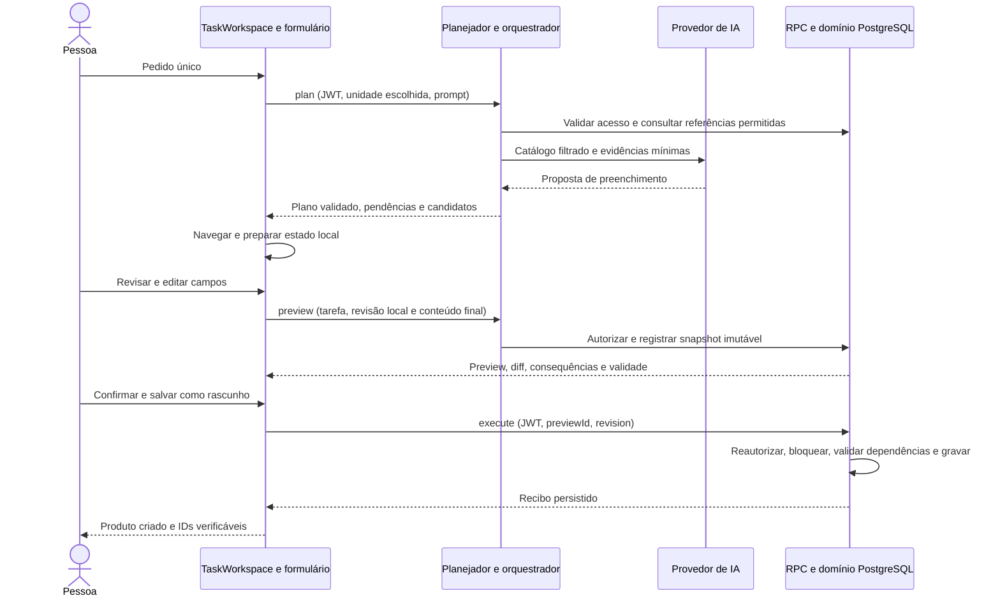
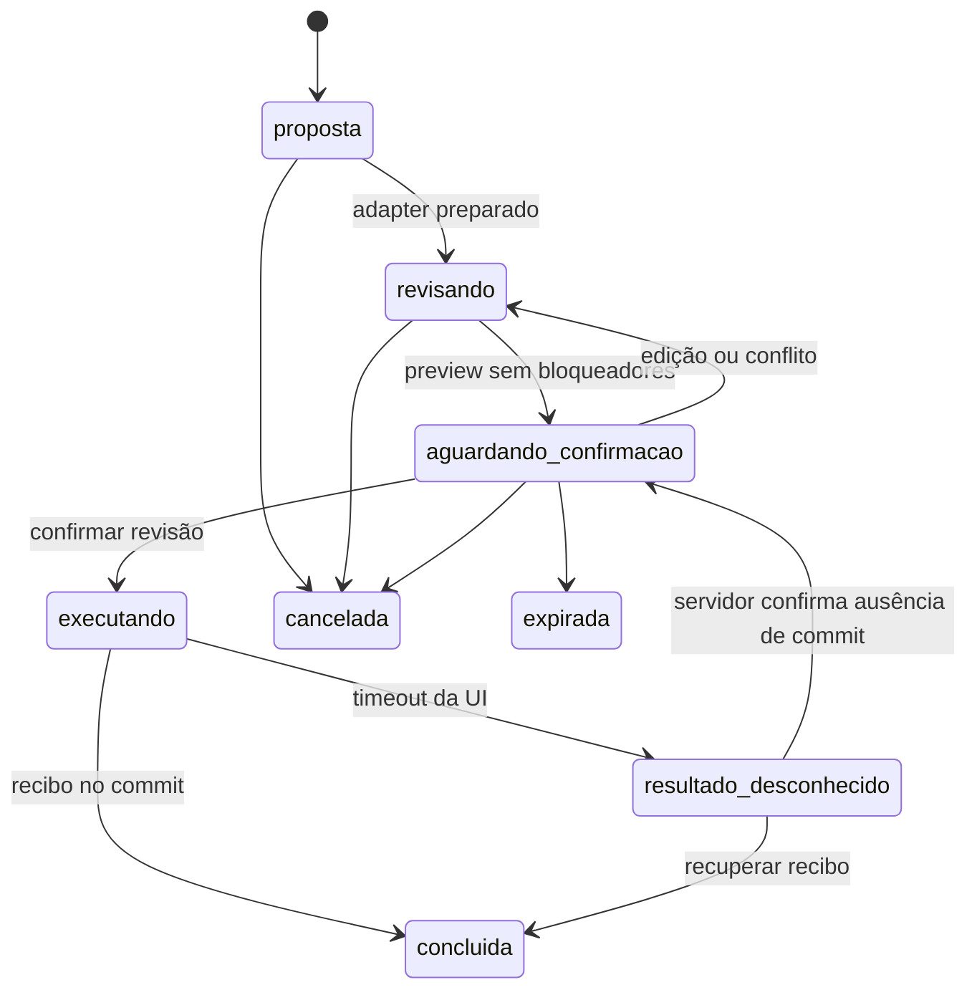

# Executor de tarefas PØP9 — arquitetura e primeiro contrato

Data: 10/10/2026. Base inspecionada: `main` em `802aef50766f74059b5252d7e604418903f51686`, após o merge da PR #49. Referências: **Arquitetura do executor de tarefas PØP9** e **Catálogo de capacidades — Cardápio e ficha técnica**, enviados pelo usuário. O catálogo define o primeiro recorte; a arquitetura geral orienta a expansão.

## Estado desta entrega

Este documento fecha as decisões de arquitetura. Acompanhando-o há contratos TypeScript, schemas de runtime, catálogo de metadados e testes da base do contrato. **Nenhum handler de gravação, RPC, migration, adapter React ou endpoint novo é ativado nesta entrega.** As bibliotecas não estão ligadas ao assistente atual. Os fluxos atuais permanecem em uso. Testes desses contratos não representam homologação do executor no ERP.

## Decisão

A IA planeja uma tarefa permitida. O código da aplicação entrega a proposta ao formulário real. O usuário edita. O servidor registra o snapshot final e mostra diferenças, consequências e pendências. A confirmação autenticada identifica somente esse preview e sua revisão. Um comando de domínio executa o snapshot armazenado, revalida autorização e registra um recibo na mesma transação.

O primeiro comando cria **um novo produto como rascunho**, seus ingredientes de exibição, vínculos da ficha técnica e insumos novos explicitamente revisados. Não publica, não edita produto existente e não movimenta estoque. A origem manual e a origem assistida compartilham o comando. A importação por arquivo mantém contrato próprio.



## Achados documentados antes de modificar fluxos

| Evidência atual | Implicação e decisão |
| --- | --- |
| `MenuTab.handleSave` chama `useAdminData.saveMenuItem` e depois `RecipeBuilder.commit`. Há várias requisições, inclusive tentativa de compensação em caso de falha. | Não usar essa sequência como handler do executor. Extrair um comando transacional antes de migrar o botão de novo rascunho. |
| `apply_menu_import` no arquivo `20261009180000_menu_import.sql` pula produtos homônimos, admite publicação por parâmetro e retorna o resultado anterior por request sem conferir o hash integral do conteúdo. | Reaproveitar conhecimento de domínio e testes; não chamar essa RPC como salvamento genérico. Preservar o importador. |
| No projeto Supabase consultado (`dtpuvegtcgddjkifsocx`), foi encontrada `ai_assistant_usage`, mas não `menu_import_requests`, `task_*` ou funções do executor. | Código versionado não comprova implantação. Checar dependências reais em staging e produção; a quota de IA não é aprovação nem recibo de negócio. |
| `menu_categories.key` tem `UNIQUE(key)` global. `menu_items.category` referencia essa chave; a categoria também possui UUID e unidade. | Resolver candidato para UUID da categoria da unidade; o comando traduz para a chave atual. Não criar categoria automaticamente nem alterar essa FK no MVP. |
| `menu_items.price` é `numeric NOT NULL`; `status` aceita `draft` e `published`. | Manter preço pendente no formulário, mas bloquear execução enquanto ausente. Não substituir ausência por zero. Um zero informado explicitamente é permitido para rascunho; publicação tem contrato posterior. |
| `recipe_items` liga produto a insumo por IDs; não possui coluna de unidade. | Validar a unidade dos dois pais a cada vínculo. FK simples não prova isolamento entre unidades. |
| `raw_materials` já contém `current_stock`, `average_cost`, `tipo` e unidade. | Reutilizar o cadastro existente. Novos insumos simples nascem com saldo e custo zero; não criar tabela paralela, lote ou movimento. |
| `useAdminData.loadMenu/loadCategories` não filtra explicitamente a unidade e os filhos são consultados amplamente. | Antes de ligar o adapter, filtrar pais pela unidade e filhos pelos IDs autorizados, limpar estado e descartar respostas antigas. RLS continua obrigatória. |
| PR #49 oferece `AGENT_PAGES`, validação de plano e rascunho guiado local; `agent-plan` não consulta cadastros operacionais. | Acrescentar catálogo de capacidades e lookup limitado. Não afirmar que o formulário real ou execução já funcionam. |

Esses achados são limites conhecidos, não autorização para corrigir outros fluxos silenciosamente. Não remover funcionalidades nem duplicar produtos, insumos, pedidos ou tabelas por provedor.

## Quatro responsabilidades

1. **Interface:** `TaskWorkspace` global dentro do roteador, independente da caixa de conversa. Mantém uma tarefa durante navegação na mesma unidade. Mostra etapa, campos, pendências, preview e recibo. O estado local não constitui aprovação.
2. **Planejador:** evolução de `admin-assistant`, sem histórico de conversa como requisito. Usa provedores já conectados e catálogo filtrado no servidor. Retorna apenas proposta tipada ou esclarecimento. Sem SQL, JavaScript executável, credenciais, rota livre ou ferramenta de execução final.
3. **Orquestrador:** biblioteca compartilhada e operações pequenas de Edge/RPC. Valida versão/schema, resolve candidatos e controla revisões. Uma passagem de IA por pedido no início; nenhuma cadeia autônoma de ferramentas.
4. **Domínio:** PostgreSQL executa o comando fechado e transacional. Autorização, consistência e repetição segura pertencem ao domínio, inclusive quando a origem é o formulário manual.

Não introduzir microserviço, fila ou navegador automatizado para esse comando local. Integrações externas futuras usam intenção/outbox e recuperação próprias.

Limites iniciais: prompt de até 4.000 caracteres, uma chamada de planejamento por intenção, contexto de até 20.000 caracteres e resposta de até 8.192 tokens (ou limite menor do modelo). Manter a reserva atômica de quota existente: 30 solicitações em 15 minutos e 200 por 24 horas por unidade. Contexto excessivo exige seleção/paginação explícita; não truncar campos críticos silenciosamente. Retry de execução não chama IA nem consome uma nova intenção. Orçamento em reais depende dos preços do provedor e deve ser configurado antes de anunciar franquia; registrar tokens reais separados do resultado de negócio.

## Catálogo e autoridade

| Capacidade v1 | Quem inicia | Efeito | Dependências |
| --- | --- | --- | --- |
| `menu.item.prepareDraft` | Usuário ou proposta da IA validada | Apenas formulário local | Adapter v1 e flag de preparação |
| `menu.item.previewDraft` | UI após revisão | Consultas e metadados de tarefa | Preparação, preview e comando v1 implantados; flag de execução |
| `menu.item.saveDraft` | Confirmação autenticada do usuário | Escrita transacional | Todas as anteriores; preview executável vigente |

Somente `prepareDraft` entra no catálogo fornecido ao modelo. `previewDraft` e `saveDraft` são chamadas determinísticas da aplicação. Publicação, exclusão, edição, geração de imagem, envio a delivery, edição em massa e compras não são capacidades do MVP. Navegação e ajuda atuais continuam pelo catálogo existente.

Cada requisição autentica o usuário e verifica unidade ativa e perfil admin válido naquela unidade. `userId`, `role`, `approved`, flags e disponibilidade enviados pela IA/body não são autoridade. O ID de unidade é apenas a escolha solicitada. O legado de admin global (`business_unit_id IS NULL`) só é reconhecido pelo mesmo critério autorizado já usado no servidor; não generalizar papel global para atendente, cozinha ou caixa.

O registro de metadados em `registry.ts` não instala funções. Flags começam desligadas. A disponibilidade depende de manifest/versionamento do backend implantado e do adapter existente, além da flag e do acesso. Respostas de disponibilidade incompatíveis bloqueiam o fluxo; não continuar com uma hipótese de versão.

## Entrada v1 e decisões fechadas

O schema compartilhado é `MenuItemDraftV1`, em `menu-item-schema.ts`. Não contém unidade de negócio, ator, `status`, saldo, custo, publicação, permissões ou URLs. O servidor fixa `status=draft`. Campos desconhecidos são rejeitados; não são descartados em silêncio.

| Assunto | Decisão para v1 |
| --- | --- |
| Dinheiro | Centavos inteiros, entre 0 e 10.000.000. `null` significa pendente. Converter para `numeric` por divisão decimal exata por 100 no banco. |
| Quantidade | String decimal positiva, ponto, até nove dígitos inteiros e seis decimais. Normalização remove zeros redundantes; não arredonda, não aceita expoente nem conversão implícita. |
| Unidade | Rótulo explícito. Para existente, deve ser exatamente o rótulo cadastrado. Para novo, deve ser selecionado no catálogo de unidades aceitas pelo módulo. Não presumir `caixa → g` nem aliases. |
| Categorias | Apenas categoria existente da unidade, escolhida/resolvida por candidato. Criar categoria continua fluxo separado. |
| Insumos existentes | Referência opaca do conjunto candidato ligado à tarefa/unidade. Backend resolve para UUID. Nome parecido não autoriza fusão. |
| Insumos novos | Nome e unidade revisados; classificação `insumo`, saldo/custo mínimo inicial zero, sem movimentação. Homônimo existente exige escolha. Não reutilizar por `LIMIT 1`. |
| Ficha vazia | Permitida e mostrada explicitamente como “sem ficha técnica”. Nenhuma quantidade ausente é omitida; linha iniciada e incompleta bloqueia. |
| Ingredientes de exibição | Lista distinta da ficha, até 30 linhas. Retirável e preço adicional explícitos; adicional pendente bloqueia. Zero significa cobrança inexistente confirmada. |
| Ficha | Até 30 linhas. Insumos produzidos existentes podem ser vinculados sem alterar sua receita. Criar preparação nova e sua receita própria será extensão específica, sem regressão no editor manual. |
| Campos manuais adicionais | Variantes, imagem já verificada, ordem e outros campos do editor continuam suportados no comando de domínio extraído. Não entram na proposta do modelo v1. |
| Nome duplicado | Preview exige decisão de nome; execução não pula nem atualiza item homônimo silenciosamente. Verificar outra vez sob bloqueio. |

Normalizar valores não equivale a conferir referências. O schema não comprova que uma categoria ou insumo existe, que a unidade é aceita ou que o ator tem acesso. Essas são validações do lookup/handler/RPC. `ManualMenuFieldsV1` declara os campos adicionais do editor que entram no comando canônico: variantes, ativo, ordem, referência de imagem verificada e receitas de novas preparações. Esse tipo ainda precisa de schema runtime e handler antes de qualquer ativação; não aceitar esse conteúdo do modelo v1. Referências de imagem devem ser resolvidas para assets da unidade pelo servidor, preservando o acervo existente.

Referências candidatas têm ID opaco curto, UUID interno, unidade, versão e validade no servidor. A IA só recebe os campos mínimos para escolher: referência, nome, unidade e classificação relevante. Consulta limitada a 100 candidatos por tipo, com pesquisa/paginação e aviso de truncamento. Quando há múltiplos candidatos, a UI pede seleção. Criar um novo insumo com nome igual ao existente em outra unidade de medida gera conflito; uma ação futura pode tratar esse caso explicitamente.

Para novos insumos repetidos na mesma proposta, agrupar somente escolhas explicitamente equivalentes em uma definição, mostrar o agrupamento e exigir revisão. Duas linhas para o mesmo UUID não geram dupla baixa nem duas definições; rejeitar duplicidade da ficha ou consolidar somente após revisão da quantidade total.

## Formulário real e comando compartilhado

Extrair de `RecipeBuilder` uma representação declarativa completa e funções puras de validação. Expor `readLocalDraft` e `prepareLocalDraft` no editor novo. Retirar as escritas de dentro do `commit` para o caminho novo transacional; não chamar métodos imperativos do componente no servidor.

O adapter descrito em `src/lib/task-capabilities/types.ts` recebe uma entrada já validada, escopo e geração. Espera o editor estar montado. Atualiza estado controlado e identifica campos propostos, sem `submit`, autosave, cliques por DOM ou persistência. Se há edição aberta, retorna conflito; manter ou mesclar exige decisão da pessoa e nova revisão. Substituição silenciosa é proibida.

O comando de domínio suporta o conteúdo completo do editor manual, com validação também no banco. O botão **Salvar rascunho** de item novo e o executor utilizam o mesmo preview e comando. Não usar uma implementação paralela só para IA. O adapter de IA v1 preenche um subconjunto; campos manuais adicionados depois também entram no snapshot final, no diff e no hash.

Publicar e editar item existente mantêm seus fluxos até terem comandos próprios compatíveis. Sua migração não pode ser consequência oculta do novo botão de rascunho. Fotos/uploads existentes são referenciados e verificados; arquivos e banco não compartilham transação. Upload temporário e limpeza dependem de um fluxo separado.

Cada alteração local incrementa `inputRevision`, invalida o preview exibido e desabilita confirmação. Navegar na mesma unidade preserva a tarefa. Trocar unidade, usuário ou perder acesso incrementa uma geração monotônica, remove adapters e invalida previews locais. Respostas anteriores são rejeitadas mesmo após sair e voltar à mesma unidade. Não enviar confirmação enquanto houver revisão local mais nova que o preview.

## APIs propostas e confirmação

Nomes abaixo são contratos futuros, não endpoints existentes. Planejamento pode evoluir na Edge Function atual; preview e execução são operações fechadas do domínio.

```text
plan      { businessUnitId, pageId, prompt, requestId, contractVersion: 1 }
          → { taskId, proposal: { capabilityId, version, input, missing } }
preview   { taskId, expectedTaskRevision, inputRevision, input, manualFields }
          → { previewId, revision, diff, consequences, blockers, expiresAt }
execute   { previewId, revision }
          → { receipt } | erro tipado
status    { taskId }
          → tarefa autorizada, último preview e eventual recibo
cancel    { taskId, expectedTaskRevision }
          → cancelada | já_concluída_com_recibo
```

`execute` não recebe conteúdo novo, ator, unidade, status de publicação, booleano de aprovação nem instruções do modelo. A UI usa `parseExecuteRequest` para validar o envelope; o servidor e a RPC fazem a mesma validação independente. A chamada autenticada ao comando final é a confirmação, condicionada à revisão exibida.

Preview é **snapshot imutável**, pertencente ao ator e unidade, vinculado a tarefa e revisão monotônica. Edições geram outro preview e invalidam o anterior sob bloqueio. Validade inicial: dez minutos. O conteúdo canônico inclui ação/versão, taskId, inputRevision, ator/unidade, todos os valores finais, referências resolvidas e versões das dependências. Arrays têm ordem definida; dinheiro é inteiro e quantidades são strings. SHA-256 é calculado no servidor sobre UTF-8 do JSON canônico ordenado (`canonicalJson`). Não misturar esse formato com `jsonb::text`, que produz bytes diferentes. Guardar os bytes canônicos e o hash, conferir correspondência com o JSON usado pelo comando e recalcular integridade na execução. Nenhum hash enviado pelo cliente substitui o snapshot armazenado.

Campos antes/depois e consequências são calculados por código a partir desse mesmo snapshot. Para criação, `before=null`; diff inclui todo conteúdo a persistir e as definições de novos insumos. A UI mostra bloqueadores, criação de insumos, ausência de ficha, nenhum efeito no saldo e status rascunho. Explicação da IA não é diff nem prova de sucesso.

Erros: 401 autenticação; 403 permissão; 400 schema/campo/valor inválido; 404 recurso indisponível no escopo; 409 revisão, referência, idempotência ou concorrência; 410 expiração; 413 limites; 429 quota; 503 dependência/provedor indisponível. Não revelar nome/ID de outra unidade na mensagem de erro.

## Persistência mínima proposta

Não aplicar DDL nesta entrega. Antes da implementação, reinspecionar schema e gerar migration aditiva pela CLI. Usar um schema privado, `task_private`, para metadados; não duplicar entidades de negócio. O browser consulta por RPC autorizada, sem acesso direto de escrita a essas tabelas.

| Registro | Conteúdo e invariantes |
| --- | --- |
| `task_private.tasks` | UUID, ator, unidade, capability/versão, estado, revisão monotônica, datas. Revisão incrementada sob bloqueio. Uma intenção de negócio por tarefa. |
| `task_private.previews` | UUID, taskId, revisão única por tarefa, inputRevision, snapshot JSON, bytes canônicos, SHA-256, referências/versões, diff, bloqueadores, consequências, expiração, estado. Conteúdo imutável. |
| `task_private.receipts` | UUID, taskId único, previewId único, revisão/hash, ator/unidade, IDs/resultados e commitAt. Append-only. Uma tarefa só produz um recibo. |

Não criar tabela de conversa nem registrar prompt completo por padrão. RLS como defesa adicional, revoke dos defaults de `PUBLIC`, `anon`, `authenticated`; nenhum grant genérico de escrita. Auditoria de IA existente continua registrando custo/quota, sem ser reutilizada como autorização de negócio.

Retenção inicial: purgar o conteúdo de snapshots e candidatos após 30 dias, mantendo a identidade/revisão/hash do preview necessária aos recibos; previews não executados expiram em dez minutos. Essa limpeza só afeta conteúdo já fora da janela de execução e não muda uma revisão executável. Manter recibos mínimos por 180 dias, sem prompt nem credenciais, e nunca antes da janela de recuperação definida. Após expirar retenção da intenção, nunca recriar automaticamente uma tarefa para “retry”; consultar o registro de negócio e exigir nova intenção explícita. Configuração de retenção deve respeitar a política operacional/privacidade antes do rollout; recibo não substitui documento fiscal.

IDs de negócio no recibo permanecem como evidência mesmo se uma exclusão autorizada ocorrer depois. Não usar cascade que destrua o histórico de execução. Status retorna o recibo somente após autenticação, autorização vigente e vínculo de ator/unidade.

## Autorização no banco e transação

Preferir RPC pública estreita, com JWT do usuário: `auth.uid()` fornece o ator. Como as tabelas privadas não dão grants diretos ao usuário e a aprovação precisa ser indivisível, a RPC de execução pode ser `SECURITY DEFINER` **somente com justificativa e controle explícito**, `search_path=''`, nomes totalmente qualificados, dono controlado, revogação de `PUBLIC/anon` e grant `EXECUTE` mínimo a `authenticated`. Não aceitar `p_user`. O corpo revalida admin, unidade ativa e ownership do preview. Funções internas no schema privado não são APIs livres. Nunca adicionar definer apenas para contornar RLS.

O planejamento na Edge pode usar service role para ler os poucos metadados e credenciais necessários depois de `auth.getUser(token)` e comprovar escopo. Não dar a esse cliente uma operação genérica de escrita. O comando final usa JWT verificado; se um futuro handler realmente precisar de service role, será outro contrato fechado, service-only e com validação explícita do ator/unidade.

Uma transação de execução:

1. Autenticar/autorizar e bloquear a tarefa, depois o preview. Consultar recibo existente da mesma tarefa/revisão/hash e devolver apenas após acesso vigente.
2. Verificar estado, versão disponível, revisão corrente, ownership, validade, ausência de bloqueadores e hash do snapshot. Recibo já concluído pode ser recuperado após a expiração do preview; não se executa novamente.
3. Bloquear categoria/insumos referenciados em ordem estável e conferir seus fingerprints. Revalidar unidade, ativo, unidades de medida e semântica do comando. Não confiar somente nos FKs.
4. Serializar criação de itens/insumos homônimos por unidade/nome; reinspecionar candidatos e detectar inserção concorrente. Regras de criação/fingerprint precisam abranger também escritores manuais existentes ou gerar conflito; não anunciar garantia enquanto um caminho concorrente puder ignorá-las.
5. Criar os insumos simples explicitamente aprovados com saldo/custo zero; reutilizar apenas UUIDs revisados. Inserir produto com `status=draft`, ingredientes, variantes manuais se presentes e ficha, todos com checks de escopo. Quando o formulário manual incluir nova preparação, criar também seu cadastro teórico, receita e insumos-base no mesmo comando, com rendimento e grafo validados; nunca produzir lote. Isso preserva o fluxo manual sem conceder essa capacidade ao modelo v1.
6. Registrar recibo e consumir aprovação/tarefa atomicamente. Commit. Não executar HTTP nem criar saldo, lote, baixa ou produção nesta transação.

Qualquer erro reverte a operação inteira. `executing` não precisa de commit separado antes do comando local: bloqueio e recibo são a autoridade. Falha pode ser registrada depois do rollback por uma operação estreita sem dar permissão de negócio; nunca marcar falha se já há recibo.

Fingerprints de dependências são calculados no banco sobre os campos relevantes atuais (UUID/unidade, nome/unidade de medida/classificação/ativo e categoria/destino), sob bloqueio. Essa decisão evita depender de `updated_at` sem contrato e detecta alterações dos caminhos legados. Uma alteração seguida de restauração idêntica não muda a semântica referenciada. Quando edição de alvos passar a ser suportada, introduzir versão monotônica em todos os escritores daquele domínio.

Duplicação concorrente de novos nomes exige proteção no domínio, não apenas lock exclusivo do executor. Antes de ativar gravação, escolher e testar constraints/trigger compatíveis após inventário de duplicidades ou migrar todos os escritores para o mesmo comando. Esta é uma dependência impeditiva do MVP, não uma garantia já implementada.

## Retry, cancelamento e estados

`taskId` é a identidade durável da intenção; o cliente não gera outro ID em retry. `previewId + revision` seleciona o conteúdo exato. Duplo clique e requisições paralelas bloqueiam a mesma intenção e retornam o mesmo recibo. Mesma identidade com outra revisão/hash após conclusão gera conflito. Acesso revogado não pode executar nem recuperar dados indevidos.

Timeout no browser é **resultado desconhecido**, não falha provada: consultar `status(taskId)` e repetir a mesma confirmação somente quando o servidor comprovar ausência de commit e validade. A UI mantém a intenção até reconciliar; não gera outra proposta por conta própria. Resultado desconhecido é estado da apresentação, não fato inferido no banco.



Preview com bloqueadores permanece revisando. Estados duráveis e transições são validados no servidor; o diagrama inclui estados de apresentação. Cancelar disputa o mesmo lock: se ganhou antes, execução não grava; se o commit já ganhou, retornar concluída com recibo. Depois do commit, desfazer é outra capacidade, não apagar silenciosamente o resultado. Troca de unidade cancela preparação local e pede cancelamento servidor; não promete interromper um commit já iniciado.

## Expansão e operação

Cada módulo futuro registra schema, autorização, preview, adapter e handler próprios. Pagamento, fechamento com senha/justificativa, emissão fiscal e acessos mantêm seus controles dedicados; a confirmação genérica não os substitui. Integrações mostram configuração, validação pendente, operacional ou erro; configuração salva não significa API pronta.

Efeitos externos usam outbox/intenção no commit local, worker durável e limite de tentativas. Idempotência do destino quando disponível; timeout sem garantia do provedor exige reconciliação antes de repetir. Imagens/documentos usam uploads temporários, referências verificadas e limpeza. Não incluir credenciais em prompts, snapshots, logs ou recibos.

Métricas: tempo até preparar/revisar/salvar, conflitos, rollback, tentativas reconciliadas, duplicações detectadas, tokens/custo da IA e correções manuais. Logs com taskId, ator, unidade, capability/versão, revisão/hash e resultado, sem prompt ou body completo. A alegação do modelo não define sucesso.

## Ordem de entrega e condições de ativação

1. **Esta PR:** desenho, contratos e testes puros. Nenhuma alteração de fluxo ou produção.
2. **Comando comum em staging:** inventário de todos os escritores, snapshot completo do editor manual, schema runtime dos campos manuais, tabelas privadas/RPCs/ACL, validações de referências e proteção de concorrência. Testes PostgreSQL reais de atomicidade, RLS e recuperação.
3. **Adapter e TaskWorkspace:** estado declarativo do editor/ficha, escopo explícito nas consultas, tratamento de edição existente e geração de contexto. Testes de preparar sem gravar, navegar e descartar respostas atrasadas.
4. **Preview e confirmação:** diff server-side completo, revisões imutáveis, expiração e recibo. Migrar o botão de novo rascunho para o mesmo comando, preservando campos e comportamento manual.
5. **Planejador v1:** lookup limitado e catálogo de preparação, validação adversarial, quota existente. Ligar preparação sem escrita primeiro.
6. **Homologação:** E2E com papéis e JWT reais, frontend/backend compatíveis, migration aplicada no staging e inspeção posterior dos dados. Depois, habilitar execução gradualmente por unidade.

Rollout: DDL aditiva e RPC compatível → backend/manifest → frontend com flags desligadas → preparação → execução somente após aceite. Rollback desliga as flags e mantém dados/recibos e endpoints de status; não reverte cadastros já confirmados nem remove fluxos atuais.

## Matriz de aceite

| Cenário | Resultado obrigatório | Verificação |
| --- | --- | --- |
| Atendente/cozinha/caixa tenta preview/execute | Negado; nenhuma leitura cruzada ou escrita | JWT reais e inspeção SQL |
| Admin tenta outra unidade/referência | Negado sem revelar dados externos | SQL/RPC e E2E multi-tenant |
| Campo extra, publicação/status, preço decimal em reais, quantidade negativa/expoente ou payload excessivo | Erro de contrato; nada descartado ou inventado | Schema compartilhado + RPC |
| Unidade divergente ou insumo ambíguo | Seleção/conflito; nenhuma conversão implícita | Lookup + SQL |
| Preço/quantidade/adicional ausente | Bloqueador; execução não aceita o preview | Preview + RPC |
| Preparar e cancelar | Nenhum produto, insumo, lote ou movimento criado | E2E + contagem de tabelas |
| Editar após preview ou confirmar revisão antiga | Nova revisão necessária | Concorrência RPC/E2E |
| Categoria/insumo muda entre preview e execução | Conflito | Duas conexões PostgreSQL reais |
| Dois cliques/retry após commit com resposta perdida | Um produto e mesmo recibo | Concorrência + falha de rede |
| Mesmo taskId com outro conteúdo/revisão após commit | Conflito, sem segundo efeito | SQL |
| Falha na última linha de ficha | Rollback integral, inclusive insumos e recibo | SQL com falha forçada |
| Criação concorrente manual/importador/assistente de homônimo | Sem duplicação silenciosa | Escritores reais concorrentes |
| Troca de usuário/unidade e resposta atrasada, inclusive ida e volta | Nada preparado/confirmado no escopo errado | E2E |
| Revogação de papel após preview | Execute e status reautorizam | SQL/JWT |
| Prompt malicioso ou nome com instruções | Texto comum; catálogo não aumenta | Planejador + servidor |
| Insumo novo teórico | Saldo/custo zero; sem lote/movimento | SQL após commit |
| Fluxo manual novo rascunho com variantes/foto/ficha | Campos preservados; mesmo comando | E2E de regressão |
| Deploy incompleto ou versão incompatível | Capacidade indisponível; fluxo atual preservado | Manifest e E2E |

Os testes desta PR cobrem somente validação de entrada, seleção de metadados e integridade do envelope de confirmação. A matriz completa permanece condição para implementar e ativar o executor.

## Arquivos de implementação

- `supabase/functions/_shared/capabilities/menu-item-schema.ts`: entrada v1, limites, decimal exato e bloqueadores locais.
- `supabase/functions/_shared/capabilities/registry.ts`: metadados e filtro de capacidades em contexto já autorizado; não é handler nem prova de acesso.
- `supabase/functions/_shared/capabilities/contracts.ts`: preview/comando/recibo, envelope de confirmação e serialização canônica.
- `src/lib/task-capabilities/types.ts`: interface do adapter, escopo e geração. Implementação React vem depois.
- `src/test/taskCapabilityContracts.test.ts`: testes da base compartilhada. Não usa credenciais nem altera Supabase.

Validação desta entrega: 54 testes novos de contrato e 27 testes existentes do assistente (81 no recorte), ESLint nos arquivos novos, TypeScript da aplicação e TypeScript estrito dos contratos passaram. Build de produção passou, com avisos existentes de CSS e tamanho de bundle. Nenhum teste desta entrega comprova transação, RLS do futuro executor ou caminho E2E de gravação; essas verificações pertencem às próximas etapas em staging.

Referências técnicas: [Database Functions](https://supabase.com/docs/guides/database/functions), [RLS](https://supabase.com/docs/guides/database/postgres/row-level-security), [changelog](https://supabase.com/changelog). Antes de escrever DDL, verificar novamente grants, assinaturas e schema do projeto alvo.
